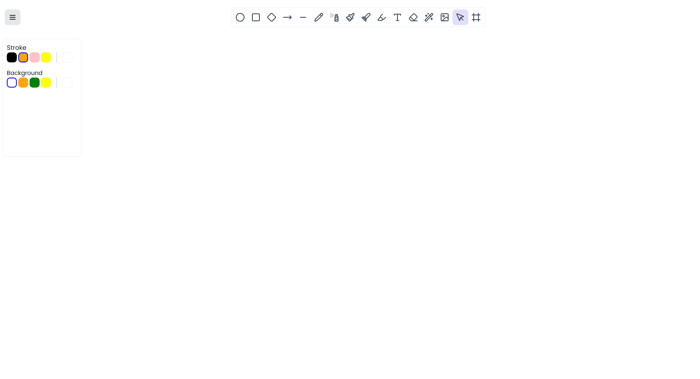
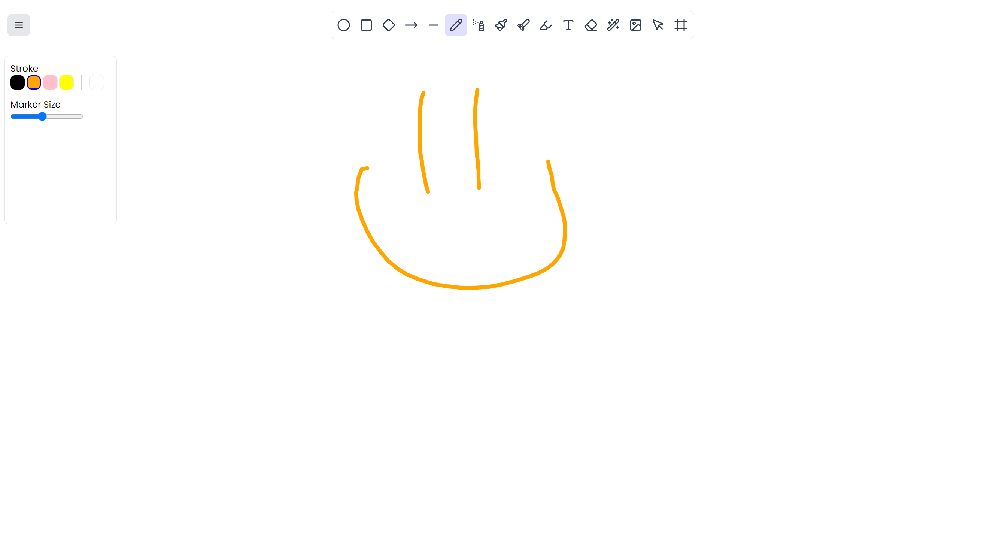
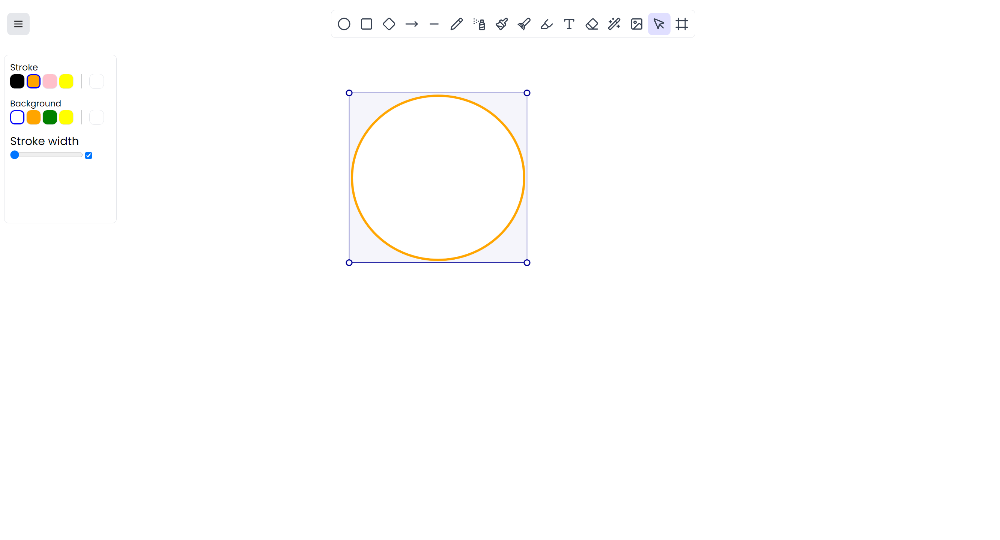

# DrawApp - Advanced Web Drawing Application

A robust, feature-rich drawing application built entirely with **p5.js** and vanilla JavaScript. This application offers a desktop-class drawing experience directly in the browser with state retention, history management, and a wide array of creative tools.





## 🚀 Features

### 🎨 Drawing Tools

- **Essential Tools**: Freehand, Line, Eraser, and Text input.
- **Shapes**: Draw perfect Squares, Ellipses, Diamonds, and generic Polygons.
- **Artistic Brushes**:
  - **Spray Can**: For airbrush-style effects.
  - **Rainbow Brush**: Dynamic multi-colored strokes.
  - **Angle Brush**: Calligraphy-style directional strokes.
  - **Mirror Draw**: Symmetrical drawing for mandala-like creations.
- **Utility**: Highlighters, Laser pointers, and Image insertion.

### 🛠️ Core Functionality

- **Retained Mode Rendering**: All elements are stored as objects, allowing for complex manipulation and re-rendering.
- **Infinite Panning**: Navigate large canvases easily using the middle mouse button.
- **Selection & Edit**: Select individual elements to move or delete them.
- **History System**: Robust Undo/Redo (`Ctrl+Z`, `Ctrl+Y`) functionality with deep state snapshots.
- **Persistence**: Your work and tool settings (brush size, color) are automatically saved to `localStorage` and restored when you return.
- **Export**: Save your masterpiece instantly as a JPG image.

### ⚙️ Customizable Interface

- **Tool Options**: Dynamic settings menu for tool-specific configurations (e.g., brush size).
- **Color Palettes**: Extensive foreground and background color pickers.

## 💻 Tech Stack

- **Render Engine**: [p5.js](https://p5js.org/) (Canvas manipulation)
- **Core Logic**: Vanilla JavaScript (ES6+)
- **DOM Manipulation**: p5.dom.js & jQuery
- **Styling**: CSS3 with modern variables and flexbox layouts

## 📂 Project Structure

```text
/
├── index.html          # Entry point and UI structure
├── sketch.js           # Main p5.js setup/draw loop and global state
├── toolbox.js          # Manager for tool selection and lifecycle
├── history.js          # Undo/Redo stack implementation
├── helperFunctions.js  # Utility helpers (save, clear, events)
├── tools/              # Individual tool implementations (Freehand, Shapes, etc.)
└── styles/             # Application styling
```

## ⌨️ Shortcuts & Controls

- **Left Click**: Draw / Use Tool
- **Middle Click (Drag)**: Pan the Canvas
- **Ctrl + Z**: Undo
- **Ctrl + Y**: Redo
- **Del**: Delete selected element

## 🔧 Getting Started

1.  Clone this repository.
2.  Open `index.html` in your web browser.
    - _Note: For the best experience (and to avoid CORS issues with local images), it is recommended to run this using a local server like Live Server in VS Code or `http-server` via npm._
